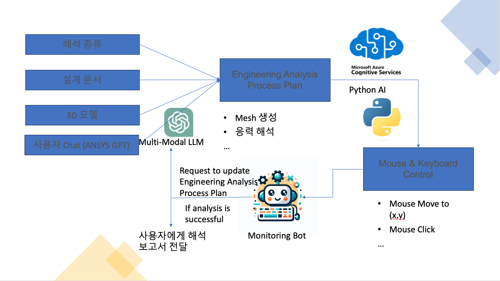
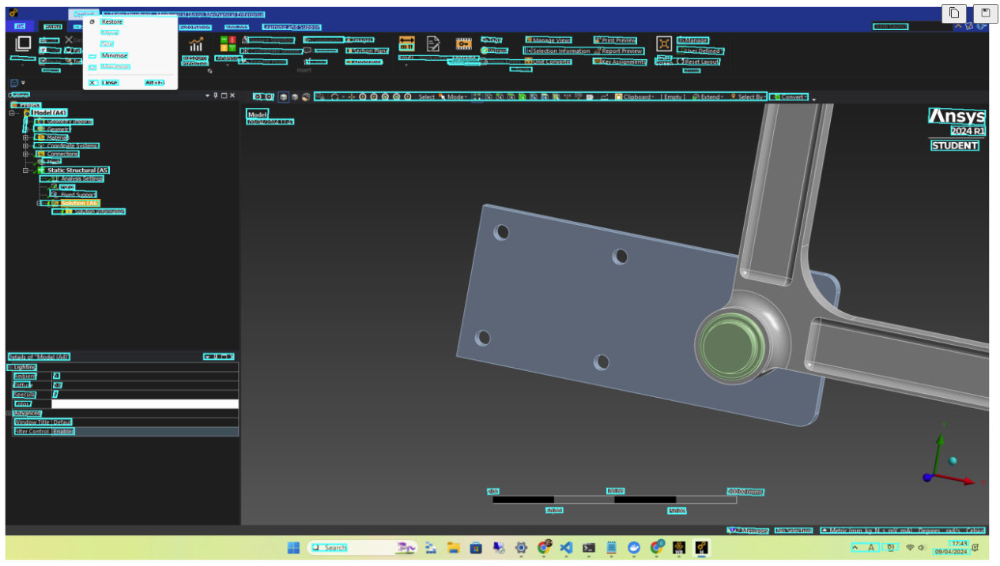

# MustAI: Automated Engineering Analysis

## Introduction
MustAI is a pioneering project designed to automate the engineering analysis process through augmented artificial intelligence. This repository contains the initial code build and innovative ideas that are the foundation of this project.

## Project Overview
MustAI integrates various technologies to automate critical engineering processes:
- **Multi-Modal LLM**: Leverages cutting-edge language models to interpret and execute engineering analysis tasks.
- **Python AI**: Utilizes Python for complex calculations and process automation.
- **Mouse & Keyboard Control**: Demonstrates direct control of engineering software through automated mouse and keyboard inputs.

## Current Features
- **Automated Mesh Generation**: Currently in development, aiming to fully automate the setup of engineering simulations.
- **Real-Time Control**: The system can perform tasks in engineering software by simulating user input, as demonstrated in the project's examples.

## Future Development
While the project has achieved significant milestones, areas like automated mesh generation need further development to realize full automation.

## Looking for Collaboration
We are open to collaboration and are looking to transfer this business idea and initial development to a partner interested in revolutionizing engineering workflows. If you are interested in this business opportunity, please contact:

**Daniel Youk**
Email: [daniel@datatrain.education](mailto:daniel@datatrain.education)

## License
This project is released under the MIT License. See the [LICENSE](LICENSE) file for more details.

## Acknowledgments
Special thanks to everyone who has contributed to the conceptualization and development of MustAI, pushing forward the boundaries of AI in engineering.
